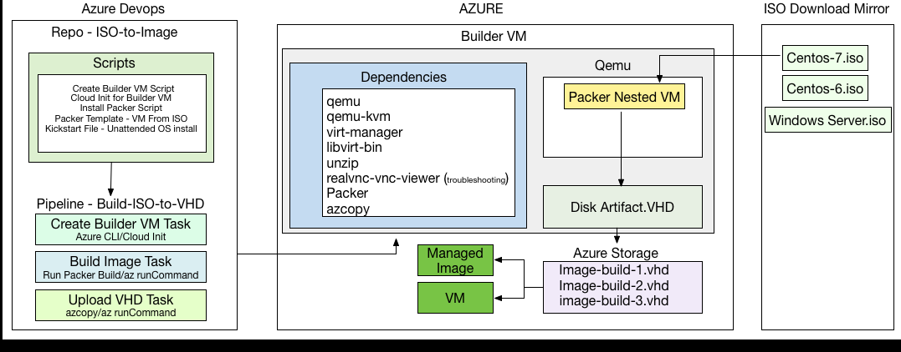
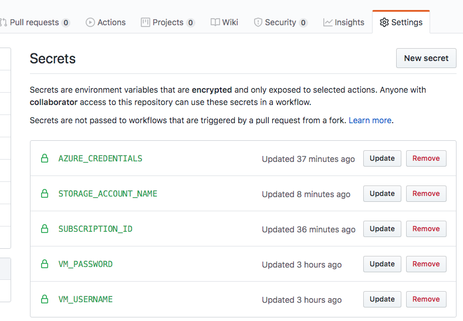

**Building Azure Images From ISO**

Have you ever had to manually install an operating system from scratch to create base images for use in the cloud? Are you required to periodically rebuild these base images because of patches and updates? Are you working on a packer plugin? This repository introduces an end to end workflow for creating base images from OS install disks in ISO format. Before jumping into this, please check out the [Azure Image Builder](https://docs.microsoft.com/en-us/azure/virtual-machines/linux/image-builder). It may be a better fit if you have a Redhat subscription or you intend to extend existing Azure Base images. It handles a lot of the complexity involved in the process I am about to describe in this document.

**How will this work?**

This process relies on the [nested virtualization](https://azure.microsoft.com/en-us/blog/nested-virtualization-in-azure/) feature available in Azure. First, a builder VM capable of running nested VMs will be created. Then within the builder VM, packer will be used to create the base images. Once the image creation process is complete, images are copied from the builder VM to Azure storage. From there, these images can be used to create VMs or used as source images in a separate workflow based on the packer [Azure Builder](https://www.packer.io/docs/builders/azure.html). 

**Requirements**

There are a few different tools required to fully automate this process. If you are not familiar with any of them it would help to read up on them before proceeding. 

* Familiarize yourself with [Github Actions](https://help.github.com/en/actions) if you have never used it before.
* Signup for an [Azure free trial](https://azure.microsoft.com/en-us/offers/ms-azr-0044p/) if you don't already have access to an Azure subscription. 
* This process relies on packer to build images so please visit the [getting started](https://www.packer.io/intro) page to familiarize yourself with the tool. Specifically, the [Qemu](https://www.packer.io/docs/builders/qemu.html) based image builder. 
* The image builder will be an Ubuntu VM configured using [cloud init](https://docs.microsoft.com/en-us/azure/virtual-machines/linux/using-cloud-init). If you are not familiar with cloud init, please take some time to [learn](https://cloudinit.readthedocs.io/en/latest/) about it. 
* The packer created nested VMs will use [kickstart](https://docs.centos.org/en-US/centos/install-guide/Kickstart2/) files to automatically install the OS. In this case, I have chosen [Centos](https://www.centos.org/download/) as the base OS. 

**The Repository**

The source code repository for this workflow will contain a set of bash scripts and the config files required for configuring the builder and nested VMs. The *.github/workflows/main.yaml* contains the workflow required to run all the scripts provided in the repository.

**The Builder VM**

The *cloud-init.yaml* is used to configure the Ubuntu Builder VM. This vm will be created using the latest Ubuntu image in the [Azure Marketplace](https://azuremarketplace.microsoft.com/en-au/marketplace/apps/Canonical.UbuntuServer). The cloud init file will also contain a base64 representation of the bash scripts required to install packer, build dependencies and config files.  Keep in mind that this file is only used as a template. The *gen-init.sh* script replaces all file paths in *cloud-init.yaml* with the base64 representation of the file and saves the result to *cloud-init-gen.yaml*. Please add this file to your *.gitignore* as it should be generated during the build process. 

The *packer-build.sh* script will be used to build the image. It will be run from Azure DevOps using the Azure CLI [run-command](https://docs.microsoft.com/en-us/cli/azure/vm/run-command?view=azure-cli-latest#az-vm-run-command-invoke) feature. This feature allows you to run a command within an Azure vm without an SSH connection. Learn more about run-command [here](https://docs.microsoft.com/en-us/azure/virtual-machines/linux/run-command). 

**The Workflow**

The workflow consists of 2 jobs. The following are the steps contained in the first job.
* The *Deploy Builder VM* step is responsible for creating the packer builder vm. 
* The *Packer build VHD* step contains is responsible for running packer. 
* The *VHD Upload* step uploads the finished VHD to Azure storage. 

The second job is optional. It simply attempts to create a vm using the newly created VHD. Use it for validation. Please view the [Github Actions workflow file](.github/workflows/build-vhd.yaml) for more details.

Please complete the following  steps:
* [create the storage account](https://docs.microsoft.com/en-us/azure/storage/blobs/storage-quickstart-blobs-portal) that will be used to upload the finished base images. Create this resource in a separate resource group.

* Navigate to *Settings -> Secrets* in your Github repository and create the following secrets:
  * *AZURE_CREDENTIALS* will be used by the Azure CLI to run all necessary commands in your Azure account. Please see the [official documentation](https://github.com/marketplace/actions/azure-cli-action) for details on creating these credentials. When creating the service principal, please set *scopes* to the entire subscription and not a specific resource group. This is because the workflow creates its own resource group.

  * *STORAGE_ACCOUNT_NAME* is the name of the storage account the workflow will use to store the VHD.

  * *VM_PASSWORD* will be used as the password for all VMs created in this workflow

  * *VM_USERNAME* will be used as the username for all VMs created in this workflow

  * *SUBSCRIPTION_ID* is not used directly in the workflow but having it saved as a secret will cause it to be redacted in the logs. 

 

* Update all environment variables to values that suit your needs. Please pay close attention to the following: 
  * The resource group name you select should not already exist. __**The script will delete the resource group if it exists**__. 
  * After the image is uploaded to storage, the resource group and all the resources in it are no longer needed. Deleting the resource group will delete the group and all resources in it. Please do not deploy any other resources to this group. Select a name that can be dedicated to this workflow. 
  * The Azure service principal used in the CLI tasks should have permissions to delete/create resource groups, managed images, storage SAS tokens and virtual machines.

* Run your workflow

**Troubleshooting**

If your image isn't being built for some reason I recommend using remote desktop to troubleshoot. The script configures the image builder vm to enable RDP access to allow frictionless troubleshooting. 
* The OSX based RDP client from Microsoft seems to be the most responsive. 
* From the builder VM desktop start a root based terminal and run the */root/packer-build.sh* build script. 
* Take note of the vnc connection information in the console output. e.g. vnc://127.0.0.1:5909
* Open the remote viewer and enter the VNC connection information
* You can now see and interact with the VM being built
* You an also run packer with the -debug flag so it will pause at each step while you manually interact with the nested vm
* Install [Real VNC Viewer](https://www.realvnc.com/en/connect/download/viewer/) if the pre-installed viewer does not work correctly.

**Summary**

If everything goes right you should have a virtual machine based on the custom VHD generated in your pipeline. When you are happy with the results, create an Azure CLI step responsible for deleting the resource group. 

If you have any questions please feel free to reach out to me on twitter [@garvincasimir](https://twitter.com/GarvinCasimir)
